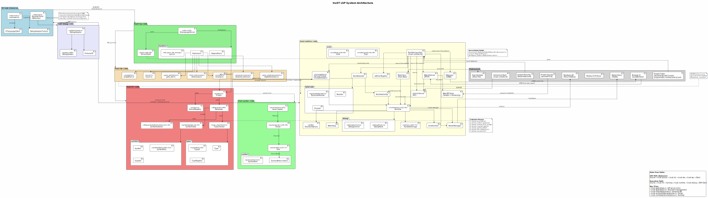

# truST Platform — Structured Text tooling for VS Code (LSP + Debugger + Runtime)

[](https://github.com/johannesPettersson80/trust-platform/actions/workflows/ci.yml)
[](LICENSE-MIT)
[](https://www.rust-lang.org)

**truST Platform** is an **IEC 61131-3 Structured Text** toolchain with first-class
VS Code support and official LSP setup profiles for Neovim and Zed:
- Language Server (**LSP**) + VS Code extension
- Runtime execution engine
- Debug Adapter (**DAP**) debugger

Stable shipped binaries: `trust-lsp`, `trust-runtime`, `trust-debug`, `trust-bundle-gen`.

> **Install:** VS Code Marketplace → **truST LSP**  
> **Docs:** `docs/README.md`

---

## Demo

### Debug session with breakpoint + runtime


### Runtime panel and live I/O


### Rename across PLC code


Capture/update media checklist: `editors/vscode/assets/README.md`

---

## Quick Start (VS Code) — 2 minutes to first success

1. Install **truST LSP** from the Marketplace.
2. Open a folder containing `.st` or `.pou` files.
3. Start editing — the language server starts automatically.
4. Open the **Structured Text Runtime** panel:
   - **Local** starts a local runtime for quick testing/debugging.
   - **External** connects to a running runtime via its control endpoint.
5. (Optional) Add a `trust-lsp.toml` at the workspace root for project settings.

### Open the Runtime Panel (30 seconds)

1. Open **Command Palette** (`Ctrl+Shift+P`).
2. Run **`Structured Text: Open Runtime Panel`**.
3. In the panel, choose mode:
   - **Local**: starts local runtime automatically.
   - **External**: connects to your configured endpoint.
4. Press **Start** in the runtime panel.
5. Set input values under **I/O → Inputs** and observe **Outputs** update live.

### Import PLCopen XML from VS Code (60 seconds)

1. Open **Command Palette** (`Ctrl+Shift+P`).
2. Run **`Structured Text: Import PLCopen XML`**.
3. Select the PLCopen XML file to import.
4. Select the target project folder (new or existing).
5. Confirm overwrite if the target folder is not empty.

Example XML to try from this repository:

- `examples/plcopen_xml_st_complete/interop/codesys-small.xml`

Command line install:

```bash
code --install-extension trust-platform.trust-lsp
```

**Expected result:** you immediately get diagnostics, navigation, semantic tokens, formatting, and code actions.

---

## Best Features

- IEC 61131-3-aware diagnostics with spec references.
- Semantic tokens, formatting, and smart code actions.
- Refactors like **Move Namespace** and rename that updates file names.
- Go to definition/references, call hierarchy, type hierarchy, and workspace symbols.
- Inline values + I/O panel driven by the runtime control endpoint.
- DAP debugging with breakpoints, stepping, and variables.
- Deterministic conformance runner via `trust-runtime conformance`.
- Official Neovim/Zed LSP setup profiles with CI smoke validation.

---

## Try Debugging (Optional but recommended)

### 1) Start the runtime

```bash
trust-runtime --project /path/to/project
```

### 2) Debug from VS Code

In VS Code run:

- **Structured Text: Start Debugging**
  or
- **Structured Text: Attach Debugger**

Notes:

- Ensure `trust-debug` is on PATH (or set `trust-lsp.debug.adapter.path` in config).
- **External** mode connects to the runtime endpoint you configured.
- **Local** mode starts a local runtime for debugging and inline values.

---

## Configuration (`trust-lsp.toml`)

Place `trust-lsp.toml` at the workspace root:

```toml
[project]
include_paths = ["libs"]
vendor_profile = "codesys"

[runtime]
control_endpoint = "unix:///tmp/trust-runtime.sock"
control_auth_token = "optional-token"
```

Inline values also work by setting the runtime endpoint from the VS Code **Structured Text Runtime** panel
(gear icon → Runtime Settings). In **External** mode the panel connects to that endpoint; in **Local** mode it
starts a local runtime for debugging and inline values.

---

## Components

| Component | Binary | Purpose |
|---|---|---|
| Language Server | `trust-lsp` | Diagnostics, navigation, refactors, IDE features |
| Runtime | `trust-runtime` | Runtime execution engine + bytecode |
| Debug Adapter | `trust-debug` | DAP adapter for breakpoints, stepping, variables |
| Bundle Tool | `trust-bundle-gen` | Generates STBC bundles |
| VS Code Extension | (bundles `trust-lsp`/`trust-debug`) | Editor UX, commands, runtime panel |

---

## Architecture



---

## Documentation

- `docs/README.md` — documentation index and diagram workflow
- `docs/guides/HMI_DIRECTORY_WORKFLOW.md` — `hmi/` directory format, process SVG pages, and LM tool workflow
- `examples/README.md` — guided example/tutorial tracks with setup walkthroughs
- `docs/guides/PLC_QUICK_START.md` — hands-on quick start
- `docs/guides/EDITOR_SETUP_NEOVIM_ZED.md` — Neovim + Zed setup and validation contract
- `docs/specs/README.md` — IEC 61131-3 specs and tooling references
- `conformance/README.md` — conformance suite MVP scope and contracts

---

## Status

- VS Code Marketplace: live
- Neovim + Zed LSP setup docs/configs: shipped (`editors/neovim/`, `editors/zed/`)
- Runtime + debugger: experimental, integrated in the platform workflow

---

## Getting Help / Community

- **GitHub Issues:** https://github.com/johannesPettersson80/trust-platform/issues
- **Email:** johannes_salomon@hotmail.com
- **LinkedIn:** https://linkedin.com/in/johannes-pettersson

---

## License

Licensed under **MIT OR Apache-2.0**. See `LICENSE-MIT` and `LICENSE-APACHE`.
