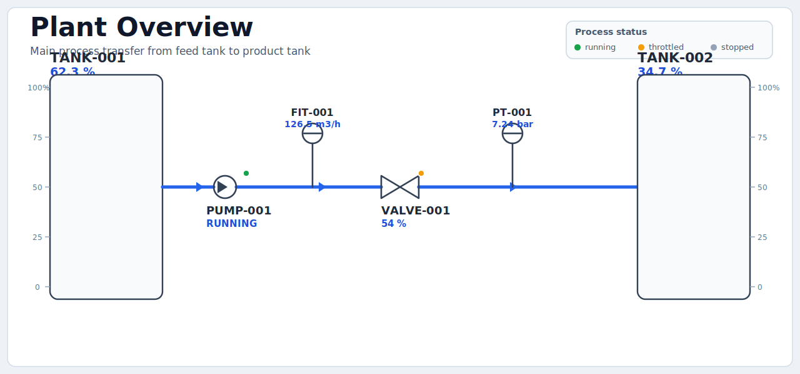
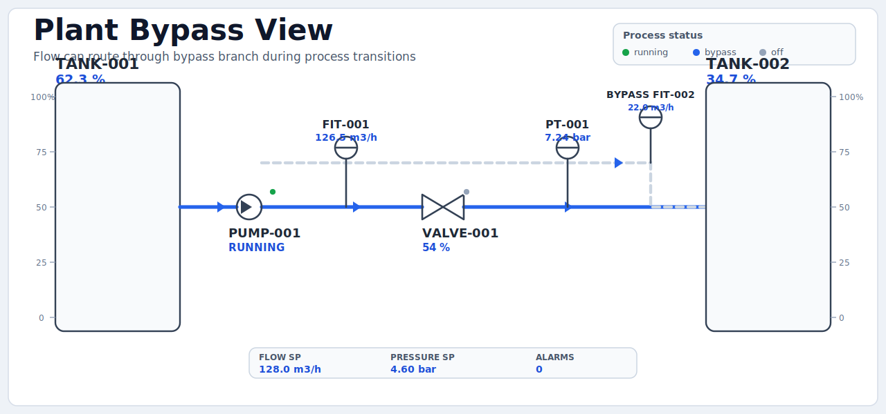

# Tutorial 12: Build a Real P&ID HMI (Process SVG + Live PLC Data)

This tutorial is a complete end-to-end workflow:

1. build a small process model in Structured Text,
2. render it as process P&ID pages in `hmi/*.svg`,
3. bind live values, setpoints, and alarms to SVG IDs,
4. capture media (screenshots/GIF) for docs and demos.

## Before You Start: Visual Preview

### Main process board



### Bypass process board



### Optional 15-second GIF capture

After runtime is running and `/hmi` is visible:

```bash
mkdir -p media
ffmpeg -y -f x11grab -video_size 1600x900 -framerate 20 -i :0.0+100,100 -t 15 media/pid-demo.mp4
ffmpeg -y -i media/pid-demo.mp4 -vf "fps=12,scale=1200:-1:flags=lanczos" media/pid-demo.gif
```

## Final Result

Open:

- `http://127.0.0.1:18082/hmi`

You will get five operator pages:

- `Operator Overview` (compact KPI summary)
- `P&ID Process` (primary process board)
- `P&ID Bypass` (bypass routing board)
- `Trends` (time-series signals)
- `Alarms` (active alarm list and acknowledgement)

## Project Layout

```text
12_hmi_pid_process_dashboard/
  README.md
  trust-lsp.toml
  runtime.toml
  io.toml
  sources/
    main.st
    config.st
  hmi/
    _config.toml
    overview.toml
    trends.toml
    alarms.toml
    plant.toml
    plant-bypass.toml
    plant.svg
    plant-minimal.svg
    plant-bypass.svg
    plant.bindings.example.txt
    pid-symbols/
      PP001A.svg
      PV022A.svg
      PT005A.svg
      LICENSE-EQUINOR-ENGINEERING-SYMBOLS.txt
```

## What Is Included (Alarms + Setpoints)

The PLC model already contains:

- flow and pressure setpoints:
  - `P1.FlowSetpointM3h`
  - `P1.PressureSetpointBar`
- live process values:
  - `P1.TotalFlowM3h`
  - `P1.MainFlowM3h`
  - `P1.BypassFlowM3h`
  - `P1.PressureBar`
- alarm booleans + summary:
  - `P1.HighPressureAlarm`
  - `P1.LowFeedAlarm`
  - `P1.HighProductAlarm`
  - `P1.AnyAlarmActive`
  - `P1.AlarmActiveCount`
  - `P1.AlarmMessage`

## Prerequisites

From repository root:

```bash
cargo build -p trust-runtime -p trust-lsp -p trust-debug
```

Optional (VS Code extension):

```bash
code --install-extension trust-platform.trust-lsp
```

## Step 1: Open the tutorial in VS Code

```bash
code examples/tutorials/12_hmi_pid_process_dashboard
```

Inspect these files first:

- `sources/main.st` (process model + setpoint/alarm logic)
- `hmi/overview.toml` (operator widget dashboard)
- `hmi/plant.toml` (primary process page bindings)
- `hmi/plant-bypass.toml` (advanced bypass process bindings)

## Step 2: Build the PLC program

```bash
cargo run -p trust-runtime --bin trust-runtime -- \
  build --project examples/tutorials/12_hmi_pid_process_dashboard --sources sources
```

Expected outcome:

- `program.stbc` generated in tutorial folder
- no compile errors

## Step 3: Run runtime with web/HMI enabled

In a new terminal:

```bash
cargo run -p trust-runtime --bin trust-runtime -- \
  run --project examples/tutorials/12_hmi_pid_process_dashboard
```

This project ships `runtime.toml` with:

- web UI on `127.0.0.1:18082`
- control endpoint `unix:///tmp/trust-runtime-tutorial-pid.sock`

## Step 4: Open and verify all HMI pages

Open:

- `http://127.0.0.1:18082/hmi`

Verify:

1. `Operator Overview`
- mode, pump, bypass, and alarm summary update
- flow and pressure KPIs remain compact and scannable
- inventory section shows levels/setpoints without oversized tank cards

2. `P&ID Process`
- pump, valve, and process line states update
- tank fill geometry (`y` + `height`) updates live
- alarm banner appears when alarms are active

3. `P&ID Bypass`
- bypass line color changes on bypass mode
- bypass flow tag updates (`pid-tag-bypass-001-pv`)
- setpoint strip (`FLOW SP`, `PRESSURE SP`, `ALARMS ACTIVE`) updates

4. `Trends`
- trend cards update while process runs
- 1m/10m/1h presets switch timescale

5. `Alarms`
- empty state while no alarms are active
- rows appear on threshold breach and support acknowledgement

## Step 5: Drive scenarios from runtime I/O

Use runtime I/O controls (or your control client):

- `%IX0.0` -> `StartCmd`
- `%IX0.1` -> `StopCmd`
- `%IX0.2` -> `PressureSpikeCmd`
- `%IX0.3` -> `BypassCmd`

Outputs to observe:

- `%QX0.0` -> `PumpRunning`
- `%QX0.1` -> `HighPressureAlarm`
- `%QX0.2` -> `LowFeedAlarm`
- `%QX0.3` -> `HighProductAlarm`
- `%QX0.4` -> `BypassOpen`

Scenario checks:

1. Set `%IX0.0 = TRUE` (start): flow rises, tanks move, mode switches to running.
2. Set `%IX0.3 = TRUE` (bypass): bypass page line/path and bypass flow activate.
3. Pulse `%IX0.2 = TRUE` (pressure spike): high-pressure alarm and banner trigger.
4. Set `%IX0.1 = TRUE` (stop): process transitions to stopped mode.

## Step 6: Understand the binding model

`hmi/plant.toml` and `hmi/plant-bypass.toml` map symbols to SVG IDs using `[[bind]]`.

Examples:

- `source = "P1.TotalFlowM3h"` -> `#pid-tag-fit-001-pv`
- `source = "P1.BypassOpen"` -> `#pid-line-bypass-001` stroke color
- `source = "P1.AlarmActiveCount"` -> `#pid-tag-alarm-count`

Safe selector/attribute guardrails are enforced (`#id` selectors and allowlisted attributes).

## Step 7: Style iteration (fast visual tuning)

If you want a cleaner style baseline, in `hmi/plant.toml` switch:

```toml
svg = "plant.svg"
```

to:

```toml
svg = "plant-minimal.svg"
```

Save and refresh `/hmi`.

IDs remain stable, so bindings continue working.

Then tweak:

- `hmi/_config.toml` (`[theme]` accent/style)
- SVG colors/strokes in `hmi/plant.svg` or `hmi/plant-bypass.svg`

Both process SVGs are now built on a fixed layout grid:

- origin `(120,220)`
- cell size `80x80`
- hidden guide layer id: `pid-layout-guides` (set opacity to `0.2` while editing)

## Step 8: Media capture for documentation

Take still screenshots:

```bash
mkdir -p media
chromium --headless --disable-gpu --window-size=1920,1080 --screenshot=media/pid-process.png http://127.0.0.1:18082/hmi
```

For animated demo, use the GIF commands from the preview section.

## Step 9: VS Code LM workflow (optional)

Use deterministic tool order:

1. `trust_hmi_get_bindings`
2. `trust_hmi_get_layout`
3. `trust_hmi_apply_patch` (`dry_run=true` first)
4. `trust_hmi_validate`
5. `trust_hmi_run_journey`

This keeps edits typed, reviewable, and evidence-backed.

## Troubleshooting

### Process page is blank

- verify page TOML contains `kind = "process"`
- verify `svg = "..."` exists under `hmi/`
- verify each `[[bind]].selector` matches a real SVG ID

### Values do not update

- confirm runtime is running on `127.0.0.1:18082`
- confirm `source = "..."` paths match ST variable names
- confirm `sources/config.st` task/program mapping is active

### Writes do not work

Tutorial is read-only by default:

```toml
[write]
enabled = false
allow = []
```

Enable writes only after explicit allowlist + safety review.

## Next Exercises

1. Add a fourth page (`hmi/alarm-drilldown.toml`) focused on alarm diagnostics.
2. Add an operator setpoint editor page after enabling safe write allowlist paths.
3. Add Phase 6 evidence artifacts (`_intent.toml`, `_lock.json`, `_evidence/`).
